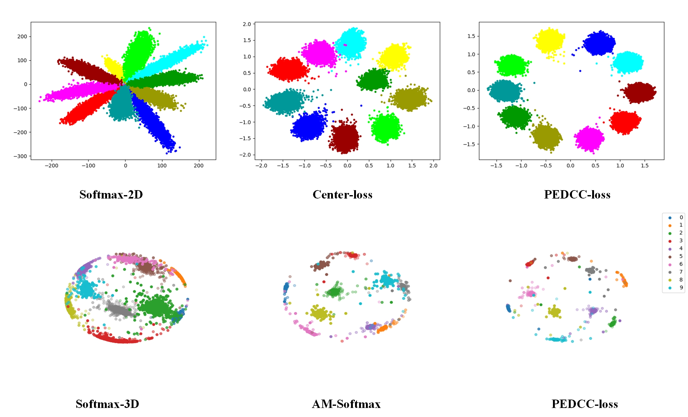

# PEDCC-Loss 
The article is available in [arxiv:1904.06008](https://arxiv.org/abs/1904.06008)

# Requirements
* Python >= 3.6
* Pytorch >= 1.0.0
* torchvision
* [yacs](https://github.com/rbgirshick/yacs) (Yet Another Configuration System)

## Data
CIFAR 100 (only)

**Note: This is just a demo to show how we generate and use the PEDCC weights in Classification Task and Metric Learning.**

## Generate PEDCC weight
Firstly, we should change the `num_classes` and `dim` to generate PEDCC as you want to use in your task. And in this code, we use CIFAR100 to train a model and the feature's dimention is 512. 
```
python utils\PEDCC.py
```
Then we get the file named `100_512.pkl`, this is the PEDCC weights

## Train Net
```
python utils\train_net.py
```

## Visualize the PEDCC in 2-D and 3-D


## Reference
The designed architecture follows this guide [PyTorch-Project-Template](https://github.com/L1aoXingyu/Deep-Learning-Project-Template)
if you think this is useful to you, please cite our technical report
```
@misc{zhu2019new,
    title={A New Loss Function for CNN Classifier Based on Pre-defined Evenly-Distributed Class Centroids},
    author={Qiuyu Zhu and Pengju Zhang and Xin Ye},
    year={2019},
    eprint={1904.06008},
    archivePrefix={arXiv},
    primaryClass={cs.CV}
}
```
